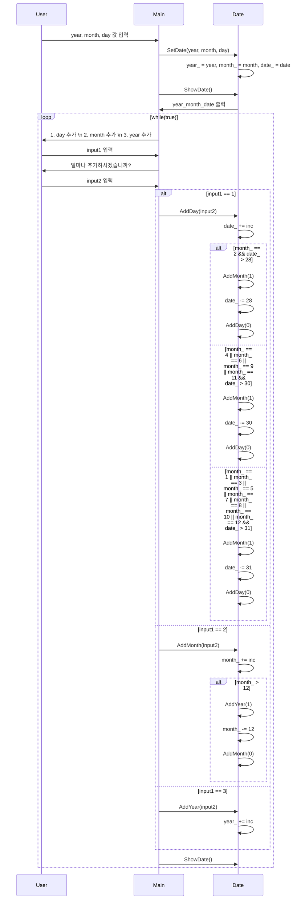

[[c++]]

객체 지향 프로그래밍

```null
#include <iostream>

class Date {
	int year_;
	int month_;  // 1 부터 12 까지.
	int date_;    // 1 부터 31 까지.

public:
	void SetDate(int year, int month, int date) {
		year_ = year;
		month_ = month;
		date_ = date;
	}
	void AddDay(int inc) {
		date_ += inc;
		if (month_ == 2 && date_ > 28) {
			AddMonth(1);
			date_ -= 28;
			AddDay(0);
		}
		if (month_ == 4 || month_ == 6 || month_ == 9 || month_ == 11 && date_ > 30) {
			AddMonth(1);
			date_ -= 30;
			AddDay(0);
		}
		if (month_ == 1 || month_ == 3 || month_ == 5 || month_ == 7 || month_ == 8 || month_ == 10 || month_ == 12 && date_ > 31) {
			AddMonth(1);
			date_ -= 31;
			AddDay(0);
		}
	}
	void AddMonth(int inc) {
		month_ += inc;
		if (month_ > 12) {
			AddYear(1);
			month_ -= 12;
			AddMonth(0);
		}
	}
	void AddYear(int inc) {
		year_ += inc;
	}
	void ShowDate() {
		std::cout << year_ << month_ << date_ << std::endl;
	}
};

int main() {
	Date date;
	int year, month, day;

	std::cout << "year, month, date 값 입력 : " << std::endl;
	std::cin >> year >> month >> day;

	date.SetDate(year, month, day);
	date.ShowDate();

	while (1) {
		int input1, input2;
		std::cout << "1. day 추가 \n" << "2. month 추가 \n" << "3. year 추가 \n";
		std::cin >> input1;
		std::cout << "얼마나 추가하시겠습니까? \n";
		std::cin >> input2;

		switch (input1) {
		case 1:
			date.AddDay(input2);
			break;
		case 2:
			date.AddMonth(input2);
			break;
		case 3:
			date.AddYear(input2);
			break;
		}

		date.ShowDate();
	}
	return 0;
}
```


```null
#include <iostream>

class Date {
	int year_;
	int month_;  // 1 부터 12 까지.
	int date_;    // 1 부터 31 까지.

public:
	void SetDate(int year, int month, int date) {
		year_ = year;
		month_ = month;
		date_ = date;
	}
	void AddDay(int inc) {
		date_ += inc;
		if (month_ == 2 && date_ > 28) {
			AddMonth(1);
			date_ -= 28;
			AddDay(0);
		}
		if (month_ == 4 || month_ == 6 || month_ == 9 || month_ == 11 && date_ > 30) {
			AddMonth(1);
			date_ -= 30;
			AddDay(0);
		}
		if (month_ == 1 || month_ == 3 || month_ == 5 || month_ == 7 || month_ == 8 || month_ == 10 || month_ == 12 && date_ > 31) {
			AddMonth(1);
			date_ -= 31;
			AddDay(0);
		}
	}
	void AddMonth(int inc) {
		month_ += inc;
		if (month_ > 12) {
			AddYear(1);
			month_ -= 12;
			AddMonth(0);
		}
	}
	void AddYear(int inc) {
		year_ += inc;
	}
	void ShowDate() {
		std::cout << year_ << month_ << date_ << std::endl;
	}
};

int main() {
	Date date;
	int year, month, day;

	std::cout << "year, month, date 값 입력 : " << std::endl;
	std::cin >> year >> month >> day;

	date.SetDate(year, month, day);
	date.ShowDate();

	while (1) {
		int input1, input2;
		std::cout << "1. day 추가 \n" << "2. month 추가 \n" << "3. year 추가 \n";
		std::cin >> input1;
		std::cout << "얼마나 추가하시겠습니까? \n";
		std::cin >> input2;

		switch (input1) {
		case 1:
			date.AddDay(input2);
			break;
		case 2:
			date.AddMonth(input2);
			break;
		case 3:
			date.AddYear(input2);
			break;
		}

		date.ShowDate();
	}
	return 0;
}
```
```null
#include <iostream>

class Date {
	int year_;
	int month_;  // 1 부터 12 까지.
	int date_;    // 1 부터 31 까지.

public:
	void SetDate(int year, int month, int date) {
		year_ = year;
		month_ = month;
		date_ = date;
	}
	void AddDay(int inc) {
		date_ += inc;
		if (month_ == 2 && date_ > 28) {
			AddMonth(1);
			date_ -= 28;
			AddDay(0);
		}
		if (month_ == 4 || month_ == 6 || month_ == 9 || month_ == 11 && date_ > 30) {
			AddMonth(1);
			date_ -= 30;
			AddDay(0);
		}
		if (month_ == 1 || month_ == 3 || month_ == 5 || month_ == 7 || month_ == 8 || month_ == 10 || month_ == 12 && date_ > 31) {
			AddMonth(1);
			date_ -= 31;
			AddDay(0);
		}
	}
	void AddMonth(int inc) {
		month_ += inc;
		if (month_ > 12) {
			AddYear(1);
			month_ -= 12;
			AddMonth(0);
		}
	}
	void AddYear(int inc) {
		year_ += inc;
	}
	void ShowDate() {
		std::cout << year_ << month_ << date_ << std::endl;
	}
};

int main() {
	Date date;
	int year, month, day;

	std::cout << "year, month, date 값 입력 : " << std::endl;
	std::cin >> year >> month >> day;

	date.SetDate(year, month, day);
	date.ShowDate();

	while (1) {
		int input1, input2;
		std::cout << "1. day 추가 \n" << "2. month 추가 \n" << "3. year 추가 \n";
		std::cin >> input1;
		std::cout << "얼마나 추가하시겠습니까? \n";
		std::cin >> input2;

		switch (input1) {
		case 1:
			date.AddDay(input2);
			break;
		case 2:
			date.AddMonth(input2);
			break;
		case 3:
			date.AddYear(input2);
			break;
		}

		date.ShowDate();
	}
	return 0;
}
```

## C++ 날짜 클래스 (Clean Code)

### 목표

C++로 작성된 날짜 클래스를 Clean Code 원칙에 따라 개선하여 가독성, 유지보수성, 확장성을 높입니다.

### 배경

기존 코드는 날짜 처리 로직이 복잡하고, 코드 중복이 있으며, 예외 처리나 유효성 검사가 미흡합니다. Clean Code 원칙을 적용하여 이러한 문제점을 해결하고, 더 안정적이고 효율적인 코드를 만듭니다.

### Clean Code 원칙 적용

1. **의미 있는 이름**: 변수, 함수, 클래스 이름을 명확하고 이해하기 쉽게 변경합니다.
2. **함수 분리**: 단일 책임을 갖는 작은 함수로 분리하여 코드 중복을 줄이고 가독성을 높입니다.
3. **유효성 검사**: 입력 값에 대한 유효성 검사를 추가하여 예외 상황을 방지합니다.
4. **불변성**: 불변 객체를 사용하여 상태 변경으로 인한 오류를 줄입니다.
5. **RAII**: 자원 관리를 자동화하여 메모리 누수를 방지합니다.

### 리팩토링된 코드

```cpp
#include <iostream>
#include <stdexcept> // 예외 처리를 위해 포함

class Date {
private:
    int year_;
    int month_; // 1부터 12까지
    int day_;   // 1부터 31까지

public:
    // 생성자: 유효성 검사 포함
    Date(int year, int month, int day) : year_(year), month_(month), day_(day) {
        if (!IsValidDate(year_, month_, day_)) {
            throw std::invalid_argument("Invalid date");
        }
    }

    // 날짜 설정 메서드 (필요한 경우)
    void SetDate(int year, int month, int day) {
        if (!IsValidDate(year, month, day)) {
            throw std::invalid_argument("Invalid date");
        }
        year_ = year;
        month_ = month;
        day_ = day;
    }

    // 날짜 증가 메서드
    void AddDays(int days) {
        day_ += days;
        NormalizeDate();
    }

    void AddMonths(int months) {
        month_ += months;
        NormalizeDate();
    }

    void AddYears(int years) {
        year_ += years;
    }

    // 날짜 표시 메서드
    void ShowDate() const {
        std::cout << year_ << "-" << month_ << "-" << day_ << std::endl;
    }

private:
    // 날짜 유효성 검사
    bool IsValidDate(int year, int month, int day) const {
        if (month < 1 || month > 12) return false;
        if (day < 1 || day > DaysInMonth(year, month)) return false;
        return true;
    }

    // 윤년 확인
    bool IsLeapYear(int year) const {
        return (year % 4 == 0 && year % 100 != 0) || (year % 400 == 0);
    }

    // 월별 일수 계산
    int DaysInMonth(int year, int month) const {
        if (month == 2) {
            return IsLeapYear(year) ? 29 : 28;
        } else if (month == 4 || month == 6 || month == 9 || month == 11) {
            return 30;
        } else {
            return 31;
        }
    }

    // 날짜 정규화
    void NormalizeDate() {
        while (day_ > DaysInMonth(year_, month_)) {
            day_ -= DaysInMonth(year_, month_);
            month_++;
            if (month_ > 12) {
                month_ = 1;
                year_++;
            }
        }
    }
};

int main() {
    try {
        Date date(2024, 1, 31);
        date.ShowDate(); // 출력: 2024-1-31

        date.AddDays(1);
        date.ShowDate(); // 출력: 2024-2-1

        date.AddMonths(1);
        date.ShowDate(); // 출력: 2024-3-1

        date.AddYears(1);
        date.ShowDate(); // 출력: 2025-3-1
    } catch (const std::invalid_argument& e) {
        std::cerr << "Exception: " << e.what() << std::endl;
        return 1;
    }

    return 0;
}
```

### 적용된 개념

- **RAII (Resource Acquisition Is Initialization)**:
    - 생성자를 통해 객체 초기화 시 유효성 검사를 수행하고, 잘못된 값이 들어오면 예외를 발생시켜 객체 생성을 막습니다. 이는 객체가 항상 유효한 상태를 유지하도록 보장합니다.
- **예외 처리**:
    - `std::invalid_argument` 예외를 사용하여 잘못된 날짜 값에 대한 예외 처리를 구현했습니다. 이를 통해 프로그램이 예기치 않은 오류로 종료되는 것을 방지하고, 사용자에게 유용한 오류 메시지를 제공할 수 있습니다.
- **함수 분리 및 재사용**:
    - `IsValidDate`, `IsLeapYear`, `DaysInMonth`, `NormalizeDate`와 같은 함수를 분리하여 코드의 가독성을 높이고, 중복 코드를 제거했습니다.
- **const 정확성**:
    - `ShowDate`, `IsValidDate`, `IsLeapYear`, `DaysInMonth` 함수를 `const` 멤버 함수로 선언하여 객체의 상태를 변경하지 않음을 명시했습니다.
- **생성자**:
    - 클래스 생성 시 유효한 날짜인지 확인하여 잘못된 객체 생성을 방지합니다.

### 설명

- **생성자**: `Date` 클래스의 생성자는 년, 월, 일을 인자로 받아 객체를 초기화합니다. 이때 `IsValidDate` 함수를 호출하여 입력된 날짜가 유효한지 검사하고, 유효하지 않은 경우 `std::invalid_argument` 예외를 발생시킵니다.
- **날짜 유효성 검사**: `IsValidDate` 함수는 주어진 년, 월, 일이 유효한 날짜인지 확인합니다. 월이 1부터 12 사이의 값인지, 일이 해당 월의 최대 일수를 초과하지 않는지 검사합니다.
- **윤년 확인**: `IsLeapYear` 함수는 주어진 년도가 윤년인지 확인합니다. 윤년은 4로 나누어 떨어지면서 100으로 나누어 떨어지지 않거나, 400으로 나누어 떨어지는 해입니다.
- **월별 일수 계산**: `DaysInMonth` 함수는 주어진 년도와 월에 따라 해당 월의 일수를 반환합니다. 윤년인 경우 2월은 29일을 반환합니다.
- **날짜 정규화**: `NormalizeDate` 함수는 날짜가 유효한 범위를 벗어날 경우 날짜를 정규화합니다. 예를 들어, 1월 32일은 2월 1일로 변경됩니다.
- **날짜 증가**: `AddDays`, `AddMonths`, `AddYears` 함수는 각각 날짜에 일을 더하거나, 월을 더하거나, 년을 더합니다. 이때 날짜가 유효한 범위를 벗어날 경우 `NormalizeDate` 함수를 호출하여 날짜를 정규화합니다.
- **날짜 표시**: `ShowDate` 함수는 날짜를 "YYYY-MM-DD" 형식으로 출력합니다.

### 결론

이 리팩토링은 Clean Code 원칙을 준수하여 코드의 가독성, 유지보수성, 확장성을 높이는 데 중점을 두었습니다. 예외 처리, 유효성 검사, 함수 분리, const 정확성 등의 기법을 적용하여 코드의 안정성과 신뢰성을 향상시켰습니다.

